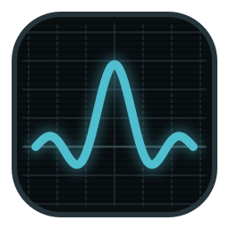

<!-- markdownlint-disable MD033 -->
<!-- Inline HTML is intentional: centered hero header and badge row. -->

<p align="center">
  
</p>

<h1 align="center">Signals and Systems</h1>

<p align="center">
  <strong>Interactive Lecture Artifact, Laboratories and Lecture Notes</strong><br>
  <sub>EE 311 · Signals and Systems — a single offline HTML file for an undergraduate signals course. Step through a scene and watch the mathematics build itself.</sub>
</p>

<p align="center">
  <a href="https://signals-and-systems-tedu.vercel.app"></a>
  &nbsp;
  <a href="dist/Signals_and_Systems.html"></a>
  &nbsp;
  
  
  
  
  
</p>

---

## Overview

**Signals and Systems** is a lecture artifact that turns a handwritten signals-and-systems course into a stepped,
self-explaining document. It covers the whole course — what a signal is, energy and power, time
transformations, periodicity, impulses and complex exponentials, system properties, linear
time-invariant systems through convolution, Fourier series, the continuous- and discrete-time Fourier
transforms, and sampling and aliasing — in 235 scenes that advance one idea at a time.

Everything runs from one HTML file. No install, no sign-in, no server, no network request at any point.
Progress is stored on the reader's own device and nowhere else. Beside the artifact sits an A4
lecture-notes PDF generated from the same content.

The artifact is written as teaching material, not as a report about teaching material: nothing in the
student view mentions how it was produced. Provenance — source pages, the issue ledger, coverage —
lives in the instructor edition of the artifact and in the working records that are not distributed.

---

## Why this artifact

A signals course is hard to follow from a static page because the meaning is in the change: what
happens to a signal when time is reversed and then shifted, why a sum of two periodic signals may not
be periodic, how a convolution integral splits into cases as one pulse slides through another. This
artifact makes that change the interface.

- **One step, one idea.** A scene reveals its parts in order, so a derivation is read rather than decoded.
- **Every figure is drawn, not pasted.** Curves, stems, impulses and block diagrams are generated per render.
- **Five laboratories.** Move a control and the classification, the period or the convolution updates with it.
- **Every number is checked.** 50 numerical results are recomputed independently in `verify/`.
- **Every label is checked.** A sweep proves that nothing written inside a figure is crossed by anything drawn in it.
- **Lecture and print from one source.** The same content produces the artifact and the printable notes.

---

## Modules

Eight modules and a closing set of three, 235 scenes in all. A module's count includes its two
question sections: the taxonomy that opens it and the thirty practice questions that close it.

| #   | Module                             | Scenes | What it covers                                                                                                                                                                     |
| --- | ---------------------------------- | ------ | ---------------------------------------------------------------------------------------------------------------------------------------------------------------------------------- |
| 0   | **Why Signals and Systems?**       | 6      | What a signal represents, what a system does, continuous versus discrete time, the course concept map, how to use the artifact                                                      |
| 1   | **Signal Foundations**             | 26     | Notation, instantaneous power, total energy and average power, energy/power/neither classification, shifting, reversal and scaling, combined transformations, periodicity, even and odd parts, DT and CT impulse and step, sifting, complex exponentials, the DT periodicity condition |
| 2   | **Systems and Their Properties**   | 14     | The input–output abstraction, memory, invertibility, causality, BIBO stability, time invariance, linearity, and a classification workflow that puts the six properties in order      |
| 3   | **Linear Time-Invariant Systems**  | 18     | Impulse response, the representation property, the convolution sum and integral, flip–shift–multiply–add, four worked convolutions including a five-case continuous-time split, convolution properties, LTI property criteria |
| 4   | **Fourier Series**                 | 44     | The eigenfunction property, the analysis and synthesis equations, existence, the rectangular and sawtooth waves, the envelope and its harmonic samples, series properties in full with a summary table for each domain, and an LTI system driven by a periodic input |
| 5   | **Continuous-Time Fourier Transform** | 53  | The limit from series to transform, existence, the standard pairs, the sinc convention, band limits and the inverse relation, every property with its proof, Parseval, convolution and multiplication, modulation, the property table and the table of pairs, partial fractions and differential equations |
| 6   | **Discrete-Time Fourier Transform**   | 44  | The same construction in discrete time, 2π-periodicity and where it comes from, the Dirichlet kernel, real spectra that change sign, periodic convolution, the property table and the table of pairs, and frequency response from a difference equation |
| 7   | **Sampling and Aliasing**          | 27     | Impulse-train sampling, spectral replication, the guard band, the sampling theorem and its strict inequality, reconstruction, zero- and first-order holds, aliasing as overlap, anti-aliasing filters, temporal and spatial aliasing |
| —   | **Closing**                        | 3      | The through-line of the whole course, what each module added, and the full table of conventions and symbols |

### Laboratories

| Lab   | In module | What it does                                                                        |
| ----- | --------- | ----------------------------------------------------------------------------------- |
| **A** | 1         | Signal transformation laboratory — shift, reverse and scale, with the support tracked |
| **B** | 1         | Energy and power classifier over six signals, each resolved to energy, power or neither |
| **C** | 1         | Periodicity explorer for continuous- and discrete-time cases                        |
| **D** | 2         | System property checker over a catalogue of systems and the six property criteria    |
| **E** | 3         | Graphical convolution explorer — the sliding overlap, case by case                   |
| **F** | 4         | Fourier-series reconstruction studio — partial sums, harmonic count and Gibbs overshoot |
| **G** | 4         | LTI frequency-response demonstrator — a periodic input through a filter, harmonic by harmonic |
| **H** | 5         | Time–frequency explorer — seven signals, their transforms, and a modulation state    |
| **I** | 6         | DTFT periodicity explorer — seven sequences drawn over three periods of 2π           |
| **J** | 7         | Sampling and aliasing studio — six presets from oversampling to first-order hold      |

### Question banks

Q1–Q7, twelve questions per module, 84 in all, in a fixed type mix: concept, calculation,
misconception, exam-style, graph-reading and synthesis. Each question carries its answer, a reason for
each distractor, a worked solution, and its source pages as instructor-only metadata.

---

## Concept Chain

Each module is a link in one argument. The course map scene renders this chain; `M` opens it at any point.

```text
signal → transformation → system → LTI system → convolution → spectrum → sampling
   │            │            │          │            │            │           │
Module 1    Module 1     Module 2   Module 3     Module 3    Modules 4-6  Module 7
notation,   shift ·      memory ·   impulse      y = x * h   Y = X · H    replication,
energy,     reverse ·    causal ·   response     case by     series and   overlap,
periodic    scale        stable     h(t), h[n]   case        transforms   recovery
```

---

## Architecture

| Layer            | Stack                                                                            |
| ---------------- | -------------------------------------------------------------------------------- |
| Artifact         | One self-contained HTML file · no runtime dependency · no network request         |
| Stage            | Fixed 1920×1080 · `fitScene()` scales an oversized scene down to a floor of 0.82  |
| Math typesetting | KaTeX, vendored and font-inlined in `20_katex.css` / `30_katex.js`                |
| Figures          | Custom SVG primitives in `60_plot.js` — axes, curves, stems, impulses, blocks, TeX labels |
| Content          | Plain JavaScript data: scenes, blocks, laboratories, questions                     |
| State            | `localStorage` on the reader's device only                                        |
| Build            | Node · `build/build.js` concatenates `build/src/*` · byte-reproducible            |
| Notes            | `notes/build.js` → HTML · `notes/topdf.js` → 25-page A4 PDF, 18 worked examples   |
| Gates            | Playwright (`qa` · `labtest` · `textclash`) · Python (NumPy · SymPy) · `rule_check` |
| Distribution     | Two files in `dist/` · no server, no analytics                                    |

The pipeline enforces a hard boundary between content and rendering. Scenes are data; `90_app.js`
renders them and `60_plot.js` draws them. A figure is produced per render rather than once at load
time, so it belongs to the palette it is drawn in instead of carrying a stale one.

---

## Design System

One visual language throughout: an ivory page with a matching dark page, a fixed set of signal colours,
and mathematics typeset in the same face wherever it appears — running text, figure axis, block diagram.

- **Signal colour is semantic.** Cyan `#14707F` input and CT signal · amber `#C08422` impulse response
  and system · green `#4A7A46` output · violet `#6A5A92` intermediate transformation ·
  red `#A63B2A` error, misconception and aliasing.
- **Page colours.** Canvas ivory `#F7F2E8` · ink `#1B1A17` · coral `#BE5539` emphasis ·
  slate `#4A657F` metadata · navy `#16232F` for module openings and synthesis scenes only.
- **Typography.** Iowan Old Style / Palatino for headings and prose, Inter for interface text,
  a monospace stack for metadata, readouts and identifiers.
- **Figures belong to their palette.** `setTheme` swaps plate, canvas and rule together with the signal
  colours, so a figure on the dark page is a dark figure and not a light one pasted onto it.
- **Every figure label is mathematics.** Axis names, block-diagram signals and annotations are TeX,
  typeset with KaTeX — never a plain string and never a Unicode substitute for a symbol.
- **Every label carries a halo** in the page colour, and axis names live outside the data area:
  the independent variable below the tick row, the dependent variable above the arrowhead.
- **Radial and orbital compositions** are reserved for course maps and synthesis scenes.

---

## Project Structure

```text
build/
├── src/
│   ├── 00_head.html            Document shell, rail, overlays
│   ├── 10_style.css            Design tokens, layout, print CSS
│   ├── 20_katex.css            Vendored KaTeX, fonts inlined
│   ├── 30_katex.js             Vendored KaTeX renderer
│   ├── 40_core.js              Navigation, keyboard, overlays, persisted state
│   ├── 60_plot.js              SVG plotting: Axes, curve, poly, stem, blocks, texName
│   ├── 70_labs.js              Laboratories A–E
│   ├── 80_content_core.js      Metadata, conventions, glossary, system catalogue
│   ├── 81_scenes_m0.js         Module 0 — why signals and systems (6 scenes)
│   ├── 82_scenes_m1.js         Module 1 — signal foundations (23 scenes)
│   ├── 83_scenes_m2.js         Module 2 — system properties (12 scenes)
│   ├── 84_scenes_m3.js         Module 3 — LTI systems and convolution (15 scenes)
│   ├── 90_app.js               Scene renderer and block types
│   ├── 91_scenes_end.js        Closing synthesis and symbol table
│   ├── 92_drill_m1.js … 98_drill_m7.js   Practice questions D1–D7, twenty a module
│   └── 99_tail.html            Scene registration and boot
├── build.js                    Concatenates src/ → dist/Signals_and_Systems.html
├── qa.js labtest.js textclash.js   Three of the five gates
└── domcheck.js mathscan.js     Two extra sweeps, not gates

notes/
├── build.js topdf.js           Lecture-notes pipeline → HTML → PDF
└── src/                        c1.js · c23.js · render.js · notes.css

verify/                         verify_m1_m3.py · verify_m4_m6.py · verify_drills.py · drill_common.py · drills_m1–m7.py
tools/rule_check.py             The editorial banned-phrase scanner
dist/                           The two deliverables
source/                         Course source material (git-ignored)
```

Folders are organised by **who the files are for**. Superseded material is deleted rather than kept
beside the current files; git history is where it survives.

---

## Quick Start

Requires Node.js 18+ and, for the numerical gate, a local arm64 Python 3.12 virtualenv.

```bash
cd build    && node build.js     # → dist/Signals_and_Systems.html
cd ../notes && node build.js     # → dist/Lecture_Notes.html
cd ../notes && node topdf.js     # → dist/Lecture_Notes.pdf
```

The artifact build is byte-reproducible: building twice from unchanged sources leaves `git status`
clean. A rebuild that produces a diff you did not author is a signal, not noise.

`.venv` is git-ignored; create it once:

```bash
/opt/homebrew/bin/python3.12 -m venv .venv && .venv/bin/pip install numpy sympy
```

Two files in `source/` are deliberately untracked: `Book.pdf`, which is third-party material and must
not be redistributed, and the 41 MB handwritten scan, which is too large for git history. A fresh clone
will not contain them — copy them in from an existing working copy before rebuilding or reading source
pages. Nothing else in the repository needs network access.

---

## Verification Gates

Eleven gates. Nothing is done until all eleven pass, and the number a run printed is the number that
gets reported.

| Gate                    | Command                                          | Must print                       |
| ----------------------- | ------------------------------------------------ | -------------------------------- |
| Layout                  | `cd build && node pw.js qa.js`                   | 0 errors, 0 overflow             |
| Interaction             | `cd build && node pw.js labtest.js`              | `ERRORS: none`                   |
| Labels                  | `cd build && node pw.js textclash.js`            | `TOTAL COLLISIONS: 0`            |
| Mathematics             | `cd build && node pw.js mathscan.js`             | `SCENES WITH MATH DAMAGE: 0 / 235`|
| Laboratories            | `cd build && node pw.js labwalk.js`              | `STATES WALKED: 1038`, `PROBLEMS: none` |
| Contents addressing     | `cd build && node pw.js seccheck.js`             | `ADDRESSED: 234`, `ANCHORED: 208` |
| Notes mathematics       | `cd build && node pw.js ../notes/mathscan.js`    | `LITERAL MATH IN NOTES: 0`       |
| Numbers, Modules 1–3    | `cd verify && ../.venv/bin/python verify_m1_m3.py` | `50 passed, 0 failed`          |
| Numbers, Modules 4–6    | `cd verify && ../.venv/bin/python verify_m4_m6.py` | `26 passed, 0 failed`          |
| Question numbers        | `cd verify && ../.venv/bin/python verify_drills.py` | `913 passed, 0 failed`        |
| Wording                 | `tools/rule_check.py` (below)                    | `TOTAL VIOLATIONS: 0`            |

```bash
.venv/bin/python tools/rule_check.py "build/src/8[1-9]_scenes*.js" "build/src/91_*.js" \
        "build/src/9[2-8]_drill_m*.js" "build/src/70_labs.js" "notes/src/*.js"
```

`qa.js` renders every scene at its last step and measures it against the stage. `labtest.js` drives
every laboratory control and mode toggle, and walks every drill pager to its last question. `textclash.js` walks every scene at every step and
tests the glyph box of every figure label against the drawn geometry of that figure. `verify_m1_m3.py` and
`verify_m4_m6.py` recompute every numerical result, one PASS/FAIL line each. `mathscan.js` reports a formula KaTeX could
not parse, mathematics left as literal `$…$`, and any element whose tag name is not valid HTML or SVG.
`rule_check.py` scans every student-facing string for phrases that would reveal how the material was
made, and for mathematics inside a figure written as anything other than LaTeX. Its banned list is
matched case-insensitively and covers page references; the `src:` field and every comment are exempt,
because those are the traceability record rather than something a student reads.

The five Playwright harnesses — `qa.js`, `labtest.js`, `textclash.js`, `domcheck.js`, `mathscan.js` —
and `notes/topdf.js` require Playwright at a fixed absolute path. Elsewhere they run unmodified behind
`build/pw.js`, a short module-resolution redirect: `node pw.js qa.js`, `node pw.js ../notes/topdf.js`.
The `require` line itself is not rewritten in place. Set `PW_PATH` if Playwright lives somewhere else.

---

## Keyboard

| Group    | Key                | Action                          |
| -------- | ------------------ | ------------------------------- |
| Steps    | `→` `Space` `PgDn` | Next step                       |
| Steps    | `←` `PgUp`         | Previous step                   |
| Scenes   | `↓` `↑`            | Next / previous scene           |
| Scenes   | `Home` `End`       | First / last scene              |
| Overlays | `M`                | Module map                      |
| Overlays | `/` `F`            | Search                          |
| Overlays | `G`                | Notation and glossary           |
| Overlays | `?`                | Help                            |
| Overlays | `Esc`              | Close any overlay               |
| Modes    | `L`                | Lecture / study mode            |
| Modes    | `I`                | Student / instructor edition    |
| Modes    | `D`                | Light / dark page               |
| Modes    | `P`                | Projector display               |
| Modes    | `R`                | Full / reduced motion           |
| Modes    | `S`                | Show / hide the rail            |

---

## What to hand out

Give students the two files in `dist/`:

- **`Signals_and_Systems.html`** — the interactive artifact, about 1 MB. Opens in any browser,
  works offline, makes no network request, stores optional progress on the reader's own device.
- **`Lecture_Notes.pdf`** — 25 pages, A4, printable and annotatable, with 18 worked examples.

Both are self-contained teaching material. Neither mentions how it was produced and neither shows
source pages; those appear only in the instructor edition of the artifact, reached with `I`.

The working records that trace a claim in the student material back to a source page are kept out of the
repository. They are not teaching material, and they are not handed out.

---

## Conventions

Fixed for the whole course, stated in the artifact where a reader first needs them.

- Energy and power are **normalised**, R = 1 Ω.
- The imaginary unit is `j`.
- `X(jω) = ∫ x(t)e^{−jωt} dt` · `x(t) = (1/2π)∫ X(jω)e^{jωt} dω`
- `X(e^{jω}) = Σ x[n]e^{−jωn}` · `x[n] = (1/2π)∫_{2π} X(e^{jω})e^{jωn} dω`
- sinc is **unnormalised**, `sinc(θ) = sin θ / θ`, restated at every point of use.

---

## Reference

The content is built from the course's own handwritten lecture notes, 88 pages. A standard text is used
as a cross-check for transform conventions, convergence conditions and scale factors only; it is never
reproduced, quoted or redistributed in any form.

---

## Current State

**v1.6 — complete.** Modules 0–7 in 235 scenes, laboratories A–J, and thirty open-ended practice
questions in every module from 1 to 7 — 210 questions, each with a worked solution that ends by testing
its own answer a second way. A module opens with a map of the question types it will ask and closes
with the questions themselves. Every Fourier property the course needs is now both taught and collected
into a summary: the series properties in a new section of Module 4, the transform properties and the
standard pairs in a scene each in Modules 5 and 6, and the same tables in Appendix A of the notes.
989 numerical checks, zero clipping, zero runtime errors, zero label collisions, and the lecture notes
beside the artifact.

All 88 source pages were read directly before anything was authored from them, and every page is mapped
to the scenes and questions that carry it. Seventy-seven confirmed issues in the source material are
recorded in the issue ledger, and each is stated in the artifact at the point where it occurs — in
the artifact's own voice, with no reference to a page or a source.

What the gates printed on the final run: 235 scenes, 0 errors, 0 overflow, 0 label collisions, 0 scenes
with damaged mathematics, 0 literal mathematics in the notes, 1038 laboratory states walked with no
problem in either theme, 234 scenes addressed and 208 anchored to the textbook, 989 numerical checks
passed, and 0 wording violations. Both builds are byte-reproducible: building twice from unchanged
sources gives the same file both times.

---

<p align="center">
  <strong>Signals and Systems</strong><br>
  <sub>📐 One file, offline, and readable on the first pass.</sub>
</p>
